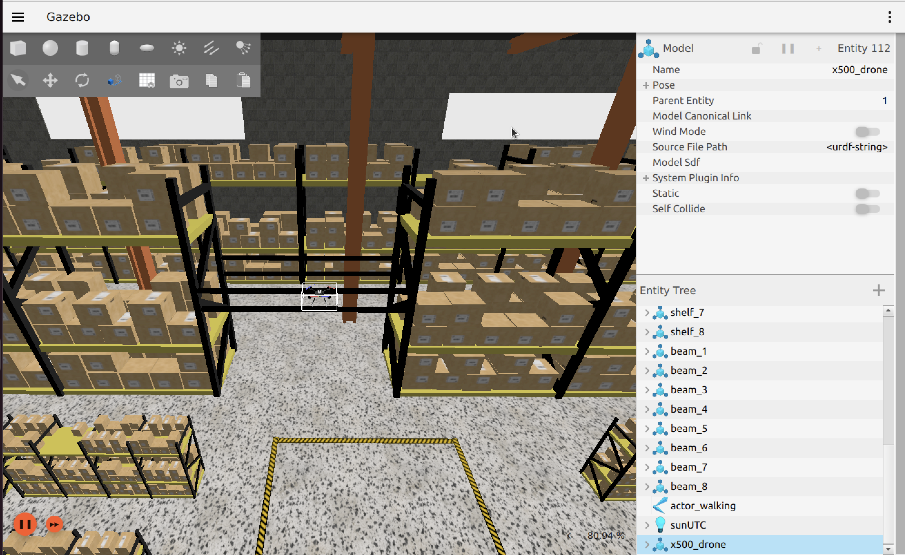
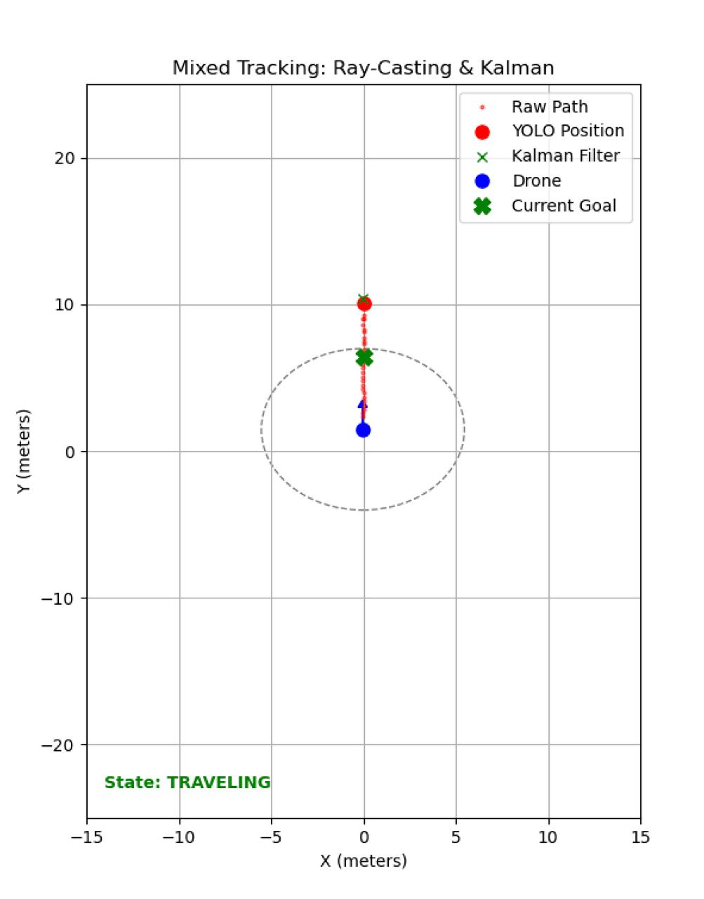
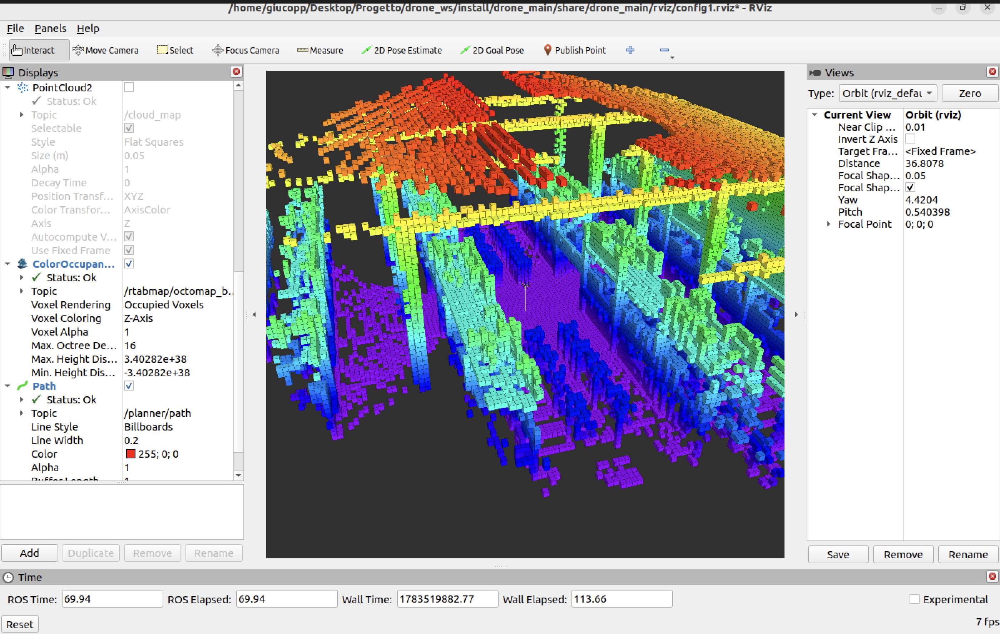
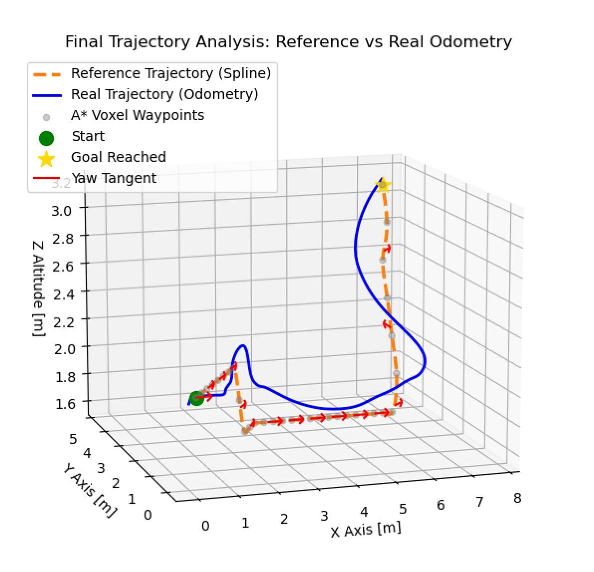
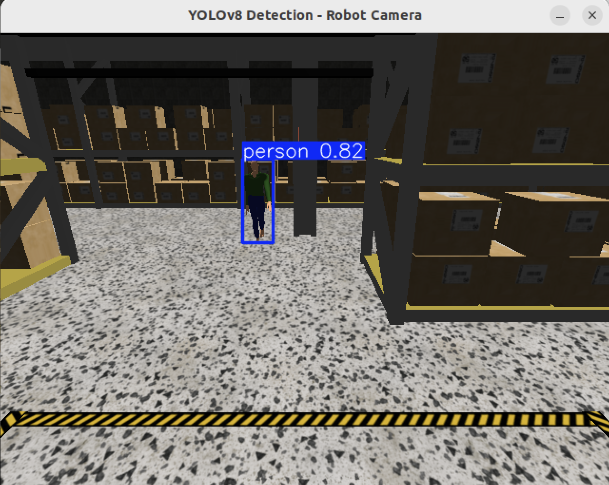

# Autonomous 3D Drone Navigation and Human Following System (ROS 2 + Mapping + AI Vision)

This repository implements a complete **autonomous UAV simulation system** in ROS 2, combining:

- 3D Mapping (RTAB-Map)
- 3D A* voxel-based path planning
- Cascaded PID flight control
- YOLOv8 human detection and tracking
- Gazebo simulation of a quadrotor (X500)

## System Architecture
```text
Gazebo Simulation
       ↓
RTAB-Map (3D occupancy grid / Octomap)
       ↓
A* 3D Planner (voxel-based path planning)
       ↓
PID Flight Controller (motor mixing)
       ↓
Drone Actuation
       ↓
Autonomous Flight Execution
```

Parallel perception pipeline:
```text
RGB Camera
       ↓
YOLOv8 (Human Detection)
       ↓
Coordinate Projection (Global Frame)
       ↓
Goal Published to A* Planner (/planner_goal)
```

## 1. Requirements

### Ros Humble Installation
Follow the instructions in the official documentation: https://docs.ros.org/en/humble/Installation.html

### Create Project Workspace
```bash
mkdir -p ~/drone_ws/src
cd ~/drone_ws/src
```

## 2. Clone the repository
Before anything else, clone this repository inside the workspace:
```bash
git clone https://github.com/g-coppola/Laboratorio_Meccatronica_RoboticaMobile.git
```

Then go to workspace root:
```bash
cd ~/drone_ws
```

## 3. Install dependencies
```bash
rosdep update
rosdep install --from-paths src --ignore-src -r -y
```
this install all required ROS dependencies in `package.xml`

## 4. System dependencies
The remaining dependencies must be installed explicitly:
```bash
sudo apt install ros-humble-ros-gz-sim
sudo apt install ros-humble-ros-gz-bridge
sudo apt install ros-humble-rtabmap-ros
sudo apt install ros-humble-octomap-msgs
sudo apt install ros-humble-octomap-rviz-plugins
```

## 5. Python dependencies 
```bash
pip3 install ultralytics matplotlib scipy
```

Compatibily note (IMPORTANT for ROS 2):
```bash
pip3 install "numpy<2"
```
Reason:
- cv_brdge and OpenCV ROS bindings may break with NumPy 2.x
- ultralytics works best with NumPy 1.x in ROS enviroments

## 6. Build the Workspace and Launch the System
```bash
cd ~/drone_ws
colcon build --symlink-install
source install/setup.bash
```

### Start Simulation (Gazebo + x500 Drone)
```bash
ros2 launch drone_main start_simulation.launch.py
```



### Start RTAB-Map
```bash
ros2 launch drone_slam start_rtabmap.launch.py
```

### Start Full Navigation Stack 
```bash
ros2 launch drone_navigation start_nav.launch.py
```
It includes `PID Controller`, `A* Planner 3D` and `Trajectory Generator`

## 7. Usage

### 3D Navigation

Once all the nodes are running, a navigation goal can be sent by publishing a `PoseStamped` message on the `/planner_goal` topic.

Example: Send the drone to `(x: 2.0, y: 1.0, z: 4.0)` while maintaining a forward-facing orientation `(Yaw = 0°)`:

Example:

```bash
ros2 topic pub --once /planner_goal geometry_msgs/msg/PoseStamped "{
  header: {frame_id: 'odom'},
  pose: {
    position: {x: 2.0, y: 1.0, z: 4.0},
    orientation: {x: 0.0, y: 0.0, z: 0.0, w: 1.0}
  }
}"
```

Note: The orientation field uses **Quaternions**. To change the final facing direction, modify the `z` and `w` values:
- 0° (Forward): `orientation: {x: 0.0, y: 0.0, z: 0.'0', w: 1.0}`
- 90° (Left): `orientation: {x: 0.0, y: 0.0, z: 0.707, w: 0.707}`
- 180° (Backward): `orientation: {x: 0.0, y: 0.0, z: 1.0, w: 0.0}`
- -90°/270° (Right): `orientation: {x: 0.0, y: 0.0, z: -0.707, w: 0.707}`

### Human Following
To enable vision-based human detection:

```bash
ros2 run drone_follow yolo_tracker
```
Also display a real-time 2D plot showing the state of the drone and the person during the tracking process.




## 8. Visualization and Debug Tools
To visualize the robot state, TF tree, and sensor data, an RViz configuration is provided.

Launch RViz with:

```bash
ros2 launch drone_main display.launch.py
```
**Recommended to launch after starting Gazebo + SLAM for full visualization.**



For visualization purposes, additional nodes are available.

### 3D Path Plotter (Visualization)

```bash
ros2 run drone_navigation plotter
```

**Recommended to launch after starting the 3D A Planner.**

Once the drone reaches the navigation goal, a 3D plot is automatically displayed, comparing the planned trajectory with the actual flight trajectory.



### Display the RGB Camera

```bash
ros2 run drone_main camera_stream
```

Displays the raw RGB camera stream published by the simulated drone.

---

### Display YOLOv8 Detections

```bash
ros2 run drone_main camera_yolo
```

Runs YOLOv8 on the camera stream and displays the detected objects with bounding boxes.



## 9. Technical Report and Demonstration Videos
A complete technical report describing the system architecture, implementation details, algorithms, and experimental results is available here:

**Technical Report:** [Open Technical Report](Report.pdf)

### Demonstration Videos
The demonstration videos of the autonomous UAV system are available in the following Google Drive folder:

**Demo Videos:** [Open Demo Videos Folder](https://drive.google.com/drive/folders/1B-mA8UbwkUpUnYRxD4US4kn_6DOJGosh?usp=sharing)

## 10. Documentation
- [Gazebo Fortress Documentation](https://gazebosim.org/docs/fortress/ros_installation/)
- [Gazebo Models](https://app.gazebosim.org/fuel/models)
- [ROS Humble Documentation](https://docs.ros.org/en/humble/About-ROS.html)
- [RTAB-Map Documentation](https://wiki.ros.org/rtabmap) 
- [Ultralytics Documentation](https://docs.ultralytics.com/#where-to-start)
